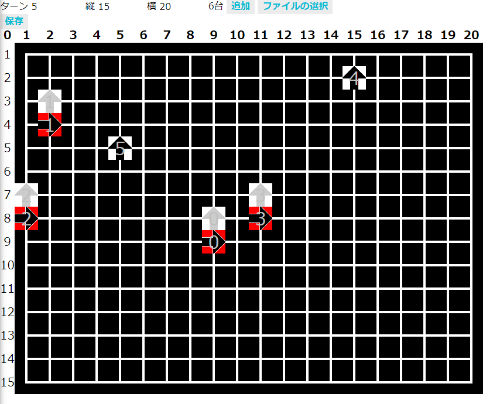
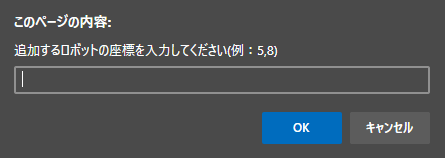
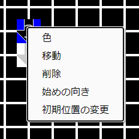
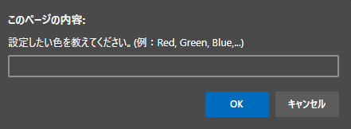
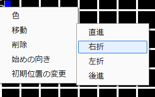
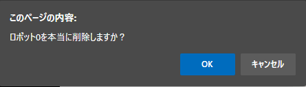
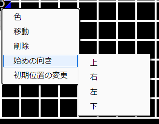
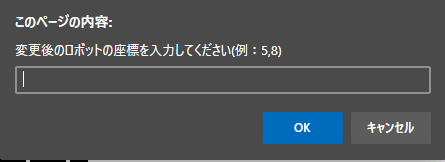

# 花火ロボットシミュレーターの説明書

## はじめに

本シミュレーターは高専ロボコン 2020 鹿児島高専 C チーム 花火ロボット（Absolute 30）のシミュレーションを行うものです。

バグや機能の改善を求める場合は 5I 田中に直接連絡してください。

## 画面の説明

ターン： 0(初期位置)から始まります。これは花火ロボットは一定時間ごとに区間を移動する仕様のためです。

縦：フィールドの縦の長さを表しています。

横：フィールドの横の長さを表しています。

〇台：ロボットの合計台数を表しています。本番では 30 台を使う予定なので 30 台となるようにしてください。

追加：ロボットの追加ボタンです。

ファイルの選択：ボタンを押し、任意の JSON ファイルを開くことで作業を再開することができます。

保存：ボタンを押し、作成したシミュレーションの結果（過程）を JSON ファイルにして保存します。

ターン、縦、横に関しては直接値を操作することができます。

## 追加

追加ボタンをクリックするとしたの画像のような入力ダイアログが表示されます。

例のように半角数字,半角数字と入力すると指定した座標にロボットが追加されます。

## ロボットについて

上はロボットの画像です。

ロボットには 0~n までの番号が割り当てられており、画像をみてわかるように配置されているロボットの中心に表示されています。

黒い矢印はロボットの向きを、背景の画像はロボットに搭載されている LED の色を表現しています。

また、ロボットの隣にしたのような画像が配置されています。

これは次のターンのロボットの位置を示しています。

次のターンまでに移動するような設定でないと、次のターンまで移動せずその場に居続けるため、次のターンのロボットの位置を示す画像は表示されません。

## ロボットの操作

ロボットの画像を右クリックすると下のようなメニューが表示されます。

このメニューの項目からロボットの色の変更、次の移動方向、削除、始めの向き、初期位置の変更を行えます。

### 色

色をクリックすると下のような入力ダイアログが表示されます。

この入力ダイアログには Red, Green, Blue, Black のような CSS で直接指定可能な文字列や#F0F0F0 や#1202A0 などのカラーコードを指定可能です。

### 移動

移動の部分にポインターを添えると右側にサブメニューが表示されます。その中から次のターンに移動するのに必要な方法をクリックしてください。（ロボットの性質上、後進を用いることはオススメしません）

クリック後、次のターンのロボットを示す画像がきちんと適応されているはずです。

### 削除

削除をクリックすると該当するロボットの削除を行います。

削除をクリック後、下のような確認ダイアログが出現します。OK を押すと削除、キャンセルを押すとキャンセルになるので操作を行ってください。

再度現れることがないので注意して行ってください。どうしても戻したい場合は、保存前に戻りますが再度ファイルを読み込みなおしてください。

### 始めの向き

始めの向きはターン 0 のみ有効で、一番始めに配置するロボットの向きを設定できます。

始めの向きにポインターを乗せるとサブメニューが表示されるので設定したい向きをクリックしてください。

## 初期位置の変更

初期位置の変更をクリックすると下のようなダイアログが表示されます。

追加ボタンの形式で、座標を入力してください。初期位置の変更が可能です。

## データの形式について

本シミュレーターにおいてデータはすべて単一の JSON によって管理されます。

格納されているデータはフィールドの縦、横の値、各ロボットの色や初期位置、移動経路です。

データの特性上、各ロボットは座標を頼りに動いているのではなく、初期位置と初期の向きから 1 ターンずつどの方向に移動するかという感じで動いています。

詳しく知りたければ JSON のファイルを見ればなんとなくわかると思います。
